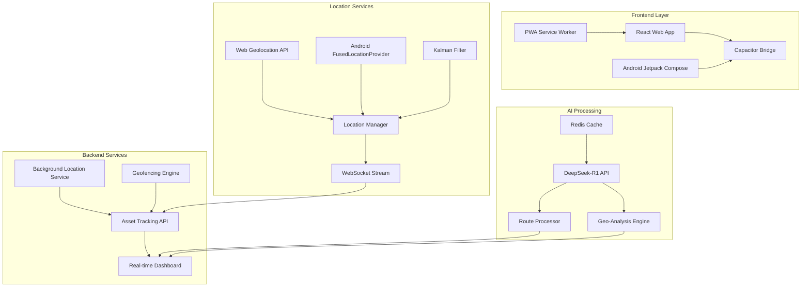

# BCV Asset Tracking Migration Plan
## Urgente: Migración a ubicación real + DeepSeek como IA core (Android/Web)

### 📋 Executive Summary

This migration plan transforms the existing BCV media assistant application into a comprehensive GPS-based asset tracking system with real-time location monitoring, while replacing Gemini AI with DeepSeek-R1 for enhanced route processing and geo-analysis capabilities.

### 🎯 Core Objectives

1. **Complete Location Simulation Removal**: Eliminate all simulated location functionality
2. **Real-time GPS Integration**: Implement precise geolocation (≤5m tolerance) using native APIs
3. **Cross-platform Optimization**: Android (Jetpack Compose) + Web (PWA with WebSocket)
4. **AI Migration**: Replace Gemini with DeepSeek-R1 for intelligent route processing
5. **Asset Tracking Dashboard**: Real-time monitoring of BCV equipment, vehicles, and personnel

### 🏗️ Technical Architecture

#### Current State Analysis
- **Framework**: React + Capacitor hybrid app
- **AI Provider**: Google Gemini (simulated DeepSeek/Mistral)
- **Platform**: Web + Android (traditional Views)
- **Location Services**: None implemented
- **Real-time Communication**: None

#### Target Architecture



### 📱 Platform-Specific Implementation

#### Web Platform
- **Geolocation**: [`navigator.geolocation.watchPosition()`](services/locationService.ts:45) with high accuracy
- **Real-time**: WebSocket connection for continuous coordinate streaming
- **PWA**: Service Worker with Cache API for offline functionality
- **Maps**: Integration with mapping library for asset visualization

#### Android Platform
- **Location Provider**: [`FusedLocationProviderClient`](android/app/src/main/java/com/bcv/app/LocationService.java:23) for optimal accuracy
- **Background Updates**: [`WorkManager`](android/app/src/main/java/com/bcv/app/LocationWorker.java:15) for battery-efficient location tracking
- **UI Framework**: Migration to Jetpack Compose for modern Android development
- **Permissions**: Runtime location permissions with proper user consent flow

### 🤖 DeepSeek Integration Strategy

#### API Endpoints
```typescript
// Route Intelligence
POST /ai/navigation
{
  "coordinates": [lat, lng],
  "destination": [lat, lng],
  "assetType": "vehicle|personnel|equipment"
}

// Geo-contextual Analysis  
POST /ai/geo-context
{
  "location": [lat, lng],
  "radius": 1000,
  "analysisType": "risk|efficiency|compliance"
}
```

#### Fallback Strategy
- **Primary**: DeepSeek-R1 API calls
- **Cache**: Redis with 24-hour TTL for last valid responses
- **No Gemini Fallback**: As specified, maintain DeepSeek-only approach

### 🔧 Technical Requirements Implementation

| Component | Specification | Implementation |
|-----------|---------------|----------------|
| **GPS Precision** | ≤5 meters tolerance | Kalman Filter + High Accuracy Mode |
| **DeepSeek Endpoints** | Route + Geo-analysis | RESTful API with TypeScript SDK |
| **Fallback Strategy** | Redis cache only | 24h TTL, no Gemini fallback |
| **Error Logging** | Sentry integration | Tag: `[DeepSeek-Integration]` |
| **Battery Optimization** | WorkManager | Adaptive location frequency |

### 📊 Data Models

#### Asset Tracking Types
```typescript
interface Asset {
  id: string;
  type: 'vehicle' | 'personnel' | 'equipment';
  name: string;
  currentLocation: GeoCoordinate;
  lastUpdate: Date;
  status: 'active' | 'inactive' | 'maintenance';
  geofences: Geofence[];
}

interface GeoCoordinate {
  latitude: number;
  longitude: number;
  accuracy: number;
  timestamp: Date;
  altitude?: number;
  heading?: number;
  speed?: number;
}

interface LocationUpdate {
  assetId: string;
  coordinate: GeoCoordinate;
  batteryLevel?: number;
  networkType: 'wifi' | 'cellular' | 'gps';
}
```

### 🚀 Implementation Phases

#### Phase 1: Foundation (Week 1)
- [ ] Update dependencies and add location/mapping libraries
- [ ] Implement basic geolocation services for web and Android
- [ ] Create asset tracking data models and database schema
- [ ] Set up DeepSeek API integration framework

#### Phase 2: Core Features (Week 2)
- [ ] Implement real-time location streaming with WebSocket
- [ ] Add Kalman filtering for GPS accuracy improvement
- [ ] Create basic asset tracking dashboard
- [ ] Integrate DeepSeek for route processing

#### Phase 3: Android Migration (Week 3)
- [ ] Migrate Android UI to Jetpack Compose
- [ ] Implement WorkManager for background location updates
- [ ] Add Android-specific location optimizations
- [ ] Battery consumption optimization

#### Phase 4: Advanced Features (Week 4)
- [ ] Implement geofencing and alert system
- [ ] Add PWA support with offline capabilities
- [ ] Integrate Sentry logging with DeepSeek tags
- [ ] Performance optimization and memory leak fixes

#### Phase 5: Testing & Deployment (Week 5)
- [ ] Comprehensive testing on both platforms
- [ ] Performance benchmarking
- [ ] Security audit and penetration testing
- [ ] Production deployment and monitoring setup

### 🔒 Security & Permissions

#### Android Permissions
```xml
<uses-permission android:name="android.permission.ACCESS_FINE_LOCATION" />
<uses-permission android:name="android.permission.ACCESS_COARSE_LOCATION" />
<uses-permission android:name="android.permission.ACCESS_BACKGROUND_LOCATION" />
<uses-permission android:name="android.permission.FOREGROUND_SERVICE" />
<uses-permission android:name="android.permission.WAKE_LOCK" />
```

#### Web Permissions
- Geolocation API consent flow
- HTTPS requirement for location access
- User privacy controls and data retention policies

### 📈 Performance Targets

- **Location Accuracy**: ≤5 meters (95% of readings)
- **Update Frequency**: 1-30 seconds (adaptive based on movement)
- **Battery Impact**: <5% additional drain per 8-hour shift
- **API Response Time**: <2 seconds for DeepSeek calls
- **Offline Capability**: 24-hour operation without network

### 🔍 Monitoring & Analytics

#### Sentry Integration
```typescript
Sentry.addBreadcrumb({
  category: 'deepseek-integration',
  message: 'Route processing initiated',
  level: 'info',
  data: { assetId, coordinates }
});
```

#### Key Metrics
- Location accuracy distribution
- DeepSeek API success/failure rates
- Battery consumption per asset type
- Real-time dashboard performance
- User engagement with tracking features

### 🎯 Success Criteria

1. **Functional**: 100% elimination of simulated location data
2. **Accuracy**: GPS precision consistently ≤5 meters
3. **Performance**: <2 second DeepSeek API response times
4. **Reliability**: 99.5% uptime for location tracking
5. **User Experience**: Intuitive asset tracking dashboard
6. **Battery**: Minimal impact on device battery life
7. **Security**: Compliant with BCV data protection standards

### 🚨 Risk Mitigation

| Risk | Impact | Mitigation Strategy |
|------|--------|-------------------|
| DeepSeek API downtime | High | Redis cache with 24h TTL |
| GPS accuracy in urban areas | Medium | Kalman filtering + sensor fusion |
| Battery drain concerns | Medium | Adaptive location frequency |
| Android migration complexity | High | Phased Compose migration |
| Real-time performance | Medium | WebSocket optimization + CDN |

### 📞 Next Steps

1. **Stakeholder Review**: Present this plan to BCV technical team
2. **Resource Allocation**: Assign development team and timeline
3. **Environment Setup**: Configure DeepSeek API keys and Redis infrastructure
4. **Development Kickoff**: Begin Phase 1 implementation

---

**Document Version**: 1.0  
**Last Updated**: 2025-08-03  
**Review Date**: Weekly during implementation  
**Approval Required**: BCV Technical Director
